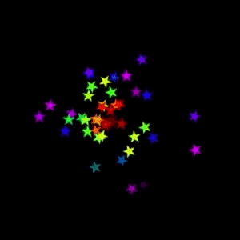

Initialize the emitter and add modifiers to change the appearance

```C#
//disable global gravity
VectorMath.gravity = new Vector2(0, 0);

//create a new world
world = new World();

star = Content.Load<Texture2D>("star");

ParticleEmitter emitter = new ParticleEmitter("Stars", world, 
    new Vector2(200, 200), //create a particle emitter at position 200px,200px
    new Interval(25, 50), //particle speed between 25 and 50 px/sec
    new Interval(-Math.PI, Math.PI), //particle direction angle (rad) between -PI and PI 
    20.0f, //20 particles per second
    new Interval(2000, 3000)); //particle life between 2000 and 3000 ms

//particles change color over their lifetime
emitter.AddModifier(new ColorRangeModifier(
        Color.Transparent, 
        Color.Red, 
        new Color(255, 255, 0), 
        new Color(0, 255, 0), 
        new Color(0, 0, 255), 
        new Color(255, 0, 255), 
        Color.Transparent));

//particles emit from a point
emitter.Origin = new PointOrigin();

//use the star texture
emitter.Texture = star;

emitter.Start();
```

Make sure to update the world in the Update method

```C#
public override void Update(GameTime gameTime)
{
    world.Step(gameTime.GetElapsedSeconds());
}
```

Use the built-in Draw method of the ParticleEmitter

```C#
public override void Draw(GameTime gameTime)
{
    base.Draw(gameTime);

    _spriteBatch.Begin(0,blendState:BlendState.Additive);
    foreach (ParticleEmitter e in world.emitters.FindAll(p => p.Name.Equals("Stars")))
    {
        e.Draw(_spriteBatch);
    }
    _spriteBatch.End();

    //other stuff
}
```

