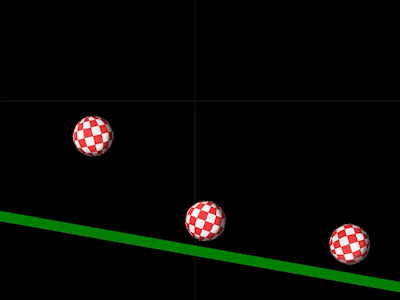

# MonoGame.Particles

MonoGame.Particles is a 2D particle system for MonoGame. It can be used as a normal particle
engine but it also supports particles that use a physics system for collisions.

To use the particle engine, a [World](Documentation/World.md)  object has to be created first. The world
object handles all updates and disposal of particle emitters.

There are 2 types of particle emitters, normal [Emitters](Documentation/Particles.md)
and [Physics Emitters](Documentation/PhysicsParticles.md). Both can be used at the same
time in the same world. Both can be customized using [Origins](Documentation/Origins.md),
[BirthModifiers](Documentation/BirthModifiers.md)
and [Modifiers](Documentation/Modifiers.md).

Also included is a simple [Physics Engine](Documentation/Physics.md) which is
based on [Impulse Engine](https://github.com/RandyGaul/ImpulseEngine) by Randy Gaul.
The engine supports:
* Circle collision
* Polygon collision
* Friction and restitution
* Collision and separation events
* Fast AABB spatial hash

Use this engine for simple stuff only. If you want accurate physics, use a more complete engine
like [Aether.Physics2D](https://github.com/tainicom/Aether.Physics2D).

